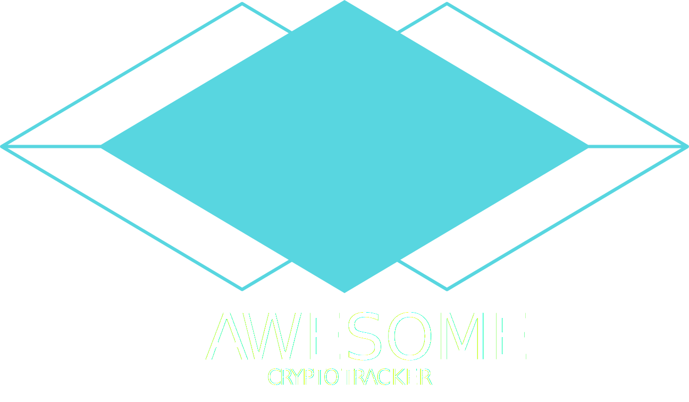

  

<h2 align="center">Awesome Crypto Tracker</h2>

---

 Quick loading table that displays real-time prices of Cryptocurrencies! 
      

## 📝 Table of Contents

- [📝 Table of Contents](#-table-of-contents)
- [🧐 About ](#-about-)
- [⛏️ Built Using ](#️-built-using-)
- [✍️ Authors ](#️-authors-)
- [🎉 Acknowledgements ](#-acknowledgements-)

## 🧐 About 

Taking this chance to play around with cool technologies like Next.JS, SWR and Chakra-UI! Loved the development experience! Also created the SVG logo from scratch :D

## ⛏️ Built Using 

- [NextJS](https://nextjs.org/) - Awesome all-in-one framework (API, routing, SEO-friendly)
- [SWR](https://swr.vercel.app/) - Client-side data fetching while ensuring validity of data from external API
- [ReactJS](https://reactjs.org/) - :D

## ✍️ Authors 

- [@kingstarfly](https://github.com/kingstarfly) - Me!

## 🎉 Acknowledgements 

- [@BrianDesign](https://www.youtube.com/watch?v=Kff_KRvpxj4&t=2768s&ab_channel=BrianDesign) - Credits for the youtube video that gave me the initial idea.
